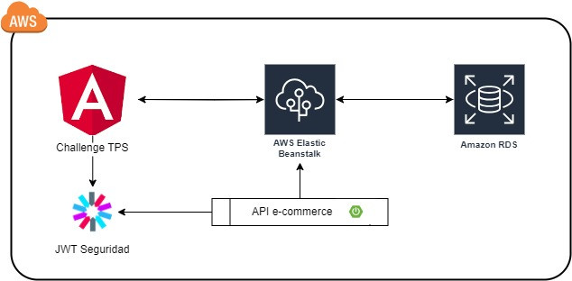

# Arquitectura Propuesta [← Ir a la página de inicio.](../Challenge-tps.md)

Este proyecto utiliza una arquitectura moderna y escalable basada en microservicios, con un frontend desarrollado en Angular y diversas integraciones para asegurar su despliegue en la nube y mantener altos estándares de seguridad y calidad de código.

## Arquitectura de Microservicios

El backend del proyecto está diseñado utilizando una arquitectura de microservicios. Cada microservicio es responsable de una funcionalidad específica y se comunica con otros microservicios a través de APIs RESTful. Esta arquitectura permite una mayor escalabilidad, mantenibilidad y despliegue independiente de cada componente del sistema.

## Frontend en Angular

El frontend del proyecto está desarrollado utilizando **Angular**, un framework de desarrollo web basado en componentes. Angular permite crear aplicaciones web dinámicas y de alto rendimiento. Algunas características clave del frontend incluyen:

- **Componentes reutilizables**: La aplicación está dividida en componentes modulares y reutilizables, lo que facilita el desarrollo y mantenimiento.
- **Enrutamiento**: Navegación fluida entre diferentes vistas de la aplicación.
- **Servicios**: Gestión de datos y comunicación con el backend a través de servicios de Angular.

## Despliegue en la Nube con AWS

El proyecto está preparado para ser desplegado en la nube utilizando **Amazon Web Services (AWS)**. Algunas de las tecnologías y servicios de AWS que se pueden utilizar incluyen:

- **Elastic Beanstalk (EBS)**: Para el despliegue y gestión de aplicaciones web y back.
- **Relational Database Service (RDS)**: Para la gestión de bases de datos relacionales.

## Seguridad con JWT

Para asegurar la autenticación y autorización en el sistema, se utiliza **JSON Web Tokens (JWT)**. JWT permite la creación de tokens seguros que se pueden utilizar para verificar la identidad de los usuarios y proteger las rutas de la API. Algunas características de seguridad incluyen:

- **Autenticación**: Verificación de la identidad del usuario mediante tokens JWT.
- **Autorización**: Control de acceso a recursos específicos basado en roles y permisos.
- **Encriptación**: Protección de datos sensibles mediante encriptación.

## Análisis de Código Estático con SonarQube

Para mantener altos estándares de calidad de código, se utiliza **SonarQube** para el análisis de código estático. SonarQube ayuda a identificar problemas de calidad, vulnerabilidades de seguridad y malas prácticas en el código. Algunas características de SonarQube incluyen:

- **Análisis de calidad**: Evaluación de la calidad del código mediante métricas y reglas definidas.
- **Detección de vulnerabilidades**: Identificación de posibles vulnerabilidades de seguridad en el código.
- **Integración continua**: Integración con herramientas de CI/CD para análisis automático del código en cada commit.

Se instala la extensión de **SonarQube** en el IDE de intelliJ para el análisis estático de código en donde se valida los aspectos anteriormente mencionados en el microservicio de back-end.

- **Reporte cobertura de código jaCoCo**
Para realizar análisis de la cobertura de código en el proyecto back se implementa el **plugin JaCoCo** y por medio de la ejecución de ciclo de vida "Test" y la ejecución del plugin **jacoco:run** se genera el reporte de cobertura donde se identifica la cobertura de código aplicada a partir de pruebas unitarias de código en el back:

---