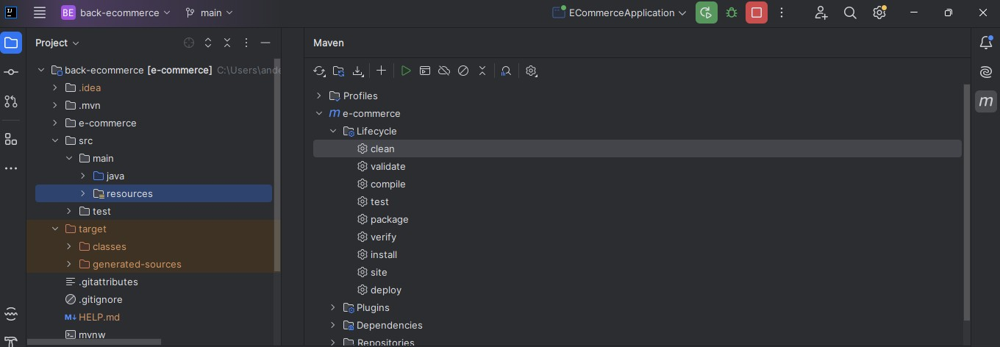
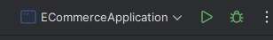
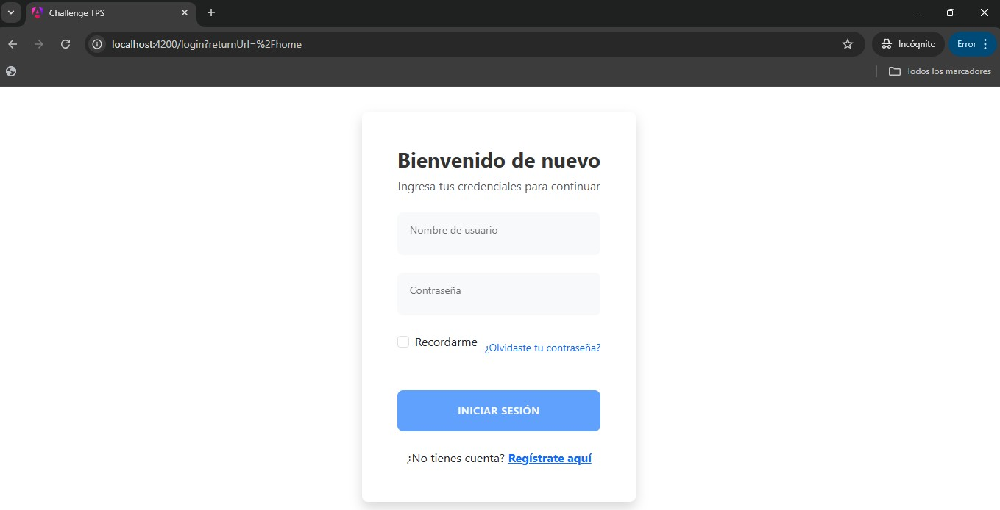
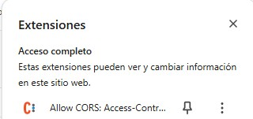
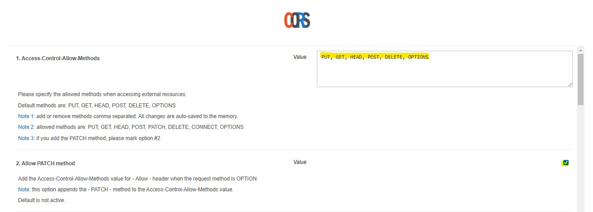
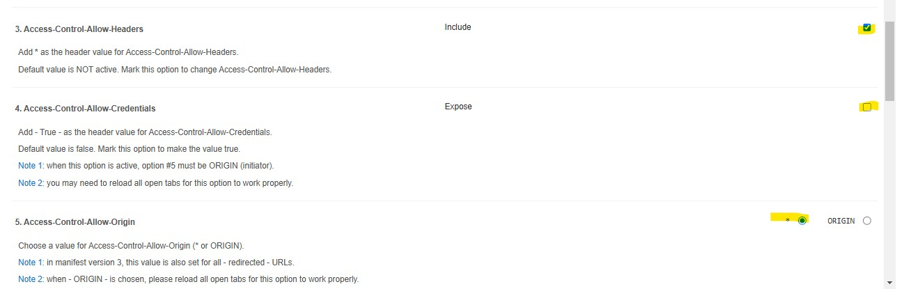
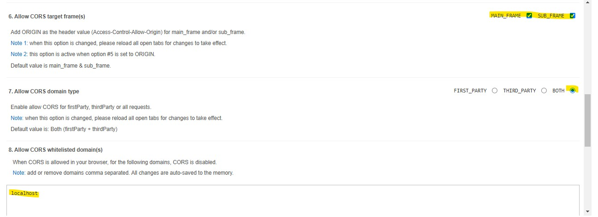
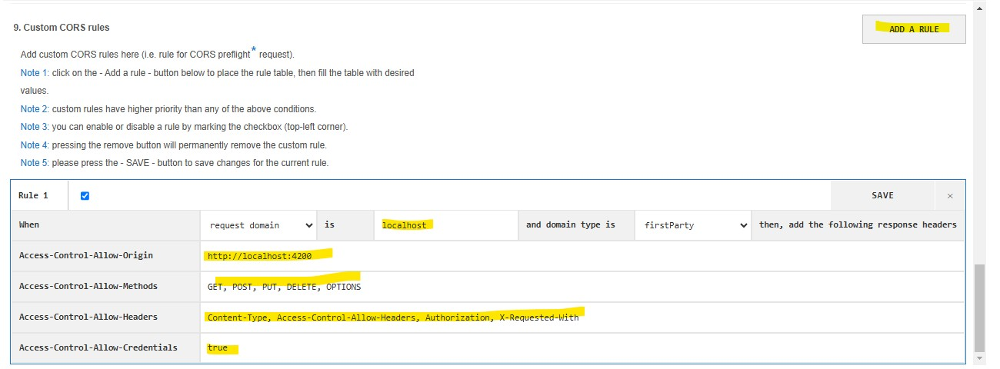

# Configuración Inicial [← Ir a la página de inicio.](../Challenge-tps.md)

### Back-end
Esta guía te ayudará a configurar el entorno necesario para desarrollar y ejecutar el backend de tu proyecto. A continuación, se detallan los pasos para instalar **Java JDK 17**, **Maven 3.9.9** y un **IDE para Spring Boot**.

## Instalación de Java JDK 17

1. **Descargar JDK 17**:
   - Visita la página de descargas de Oracle para Java SE Development Kit 17.
   - Selecciona el instalador adecuado para tu sistema operativo (Windows, macOS, Linux) y descarga el archivo.

2. **Instalar JDK 17**:
   - Sigue las instrucciones de instalación específicas para tu sistema operativo.

3. **Verificar la instalación**:
   - Abre una terminal o símbolo del sistema y ejecuta el siguiente comando para verificar que Java se ha instalado correctamente:
     ```bash
     java -version
     ```
   - Deberías ver una salida similar a:
     ```
     java version "17.0.x"
     ```

## Instalación de Maven 3.9.9

1. **Descargar Maven 3.9.9**:
   - Visita la página de descargas de Apache Maven para Maven 3.9.9.

2. **Instalar Maven 3.9.9**:
   - Extrae el archivo descargado en el directorio de tu elección.
   - Añade el directorio `bin` de Maven a la variable de entorno `PATH`. Por ejemplo, en Windows:
     ```bash
     set PATH=%PATH%;C:\ruta\a\apache-maven-3.9.9\bin
     ```
     En macOS/Linux, añade la siguiente línea a tu archivo `~/.bashrc` o `~/.zshrc`:
     ```bash
     export PATH=$PATH:/ruta/a/apache-maven-3.9.9/bin
     ```

3. **Verificar la instalación**:
   - Abre una terminal o símbolo del sistema y ejecuta el siguiente comando para verificar que Maven se ha instalado correctamente:
     ```bash
     mvn -v
     ```
   - Deberías ver una salida similar a:
     ```
     Apache Maven 3.9.9
     ```

## Instalación de un IDE para Spring Boot

1. **Descargar e instalar un IDE**:
   - Puedes utilizar cualquier IDE compatible con Spring Boot. Algunas opciones populares incluyen:
     - IntelliJ IDEA (Seleccionado para el desarrollo)
     - Spring Tool Suite (STS)
     - Eclipse
## Descargar y Compilar el Repositorio del Proyecto Backend

1. **Clonar el repositorio**:
   - Abre una terminal o símbolo del sistema y ejecuta el siguiente comando para clonar el repositorio del proyecto backend:
     ```bash
     git clone https://github.com/aflorezgut123/challenge-back.git
     ```

2. **Navegar al directorio del proyecto**:
   - Cambia al directorio del proyecto clonado:
     ```bash
     cd tu_proyecto_backend
     ```

3. **Compilar el proyecto**:
   - Ejecuta el siguiente comando para compilar el proyecto utilizando Maven:
     ```bash
     mvn clean install
     ```
   - Nota aclaratoria: se uso IntelliJ para el uso adecuado del ciclo de vida de Maven
   

4. **Ejecutar el proyecto**:
   - Una vez compilado, puedes ejecutar el proyecto con el siguiente comando:
     ```bash
     mvn spring-boot:run
     ```
   - Nota aclaratoria: se uso IntelliJ para el uso adecuado del ciclo de vida de Maven
   


### Frond-end
Esta guía te ayudará a configurar el entorno necesario para desarrollar y ejecutar el frontend de tu proyecto. A continuación, se detallan los pasos para instalar **Node 18.20.6**, configurar **Visual Studio Code**, descargar el repositorio del frontend, compilar el proyecto y configurar la extensión CORS en el navegador.

## Instalación de Node 18.20.6

1. **Descargar Node 18.20.6**:
   - Visita la página de descargas de Node.js para Node 18.20.6.
   - Selecciona el instalador adecuado para tu sistema operativo (Windows, macOS, Linux) y descarga el archivo.

2. **Instalar Node 18.20.6**:
   - Sigue las instrucciones de instalación específicas para tu sistema operativo:
     - Guía de instalación para Windows
     - Guía de instalación para macOS
     - Guía de instalación para Linux

3. **Verificar la instalación**:
   - Abre una terminal o símbolo del sistema y ejecuta el siguiente comando para verificar que Node.js se ha instalado correctamente:
     ```bash
     node -v
     ```
   - Deberías ver una salida similar a:
     ```
     v18.20.6
     ```

## Configuración de Visual Studio Code

1. **Descargar e instalar Visual Studio Code**:
   - Visita la página de descargas de Visual Studio Code y selecciona el instalador adecuado para tu sistema operativo.

2. **Configurar Visual Studio Code**:
   - Sigue las instrucciones de instalación y configuración específicas para tu sistema operativo:
     - Guía de configuración de Visual Studio Code
   - Personaliza el editor según tus preferencias, como el tema de color, las extensiones recomendadas y los atajos de teclado.

3. **Instalar extensiones recomendadas**:
   - Abre Visual Studio Code y navega a la sección de extensiones (icono de cuadrados en la barra lateral izquierda).
   - Busca e instala las siguientes extensiones recomendadas:
     - **ESLint**: Para la verificación de código JavaScript.
     - **Prettier - Code formatter**: Para el formateo automático del código.
     - **Live Server**: Para la recarga automática del navegador al guardar cambios.

## Descargar y Compilar el Repositorio del Proyecto Frontend

1. **Clonar el repositorio**:
   - Abre una terminal o símbolo del sistema y ejecuta el siguiente comando para clonar el repositorio del proyecto frontend:
     ```bash
     git clone https://github.com/aflorezgut123/challenge-front.git
     ```

2. **Navegar al directorio del proyecto**:
   - Cambia al directorio del proyecto clonado:
     ```bash
     cd tu_proyecto_frontend
     ```

3. **Instalar las dependencias**:
   - Ejecuta el siguiente comando para instalar las dependencias del proyecto utilizando npm:
     ```bash
     npm install o npm i
     ```

4. **Compilar y ejecutar el proyecto**:
   - Una vez instaladas las dependencias, puedes compilar y ejecutar el proyecto con el siguiente comando:
     ```bash
     npm start o ng serve
     ```

5. **Verificar la ejecución**:
   - Abre tu navegador y navega a `http://localhost:4200` para verificar que la aplicación frontend está corriendo correctamente.

   

## Instalación de la Extensión CORS en el Navegador

1. **Descargar la extensión CORS**:
   - Visita la página de la extensión CORS en la Chrome Web Store: Allow CORS: Access-Control-Allow-Origin.

2. **Instalar la extensión**:
   - Haz clic en el botón "Añadir a Chrome" y sigue las instrucciones para instalar la extensión en tu navegador.

3. **Configurar la extensión**:
   - Una vez instalada, haz clic en el icono de la extensión en la barra de herramientas del navegador y actívala para permitir las solicitudes CORS.

   


   - La configuración recomendada es la siguiente:
   
   
   
   


---